# ESP-IDF开发环境搭建—EIM（2026最新推荐）

> [!TIP] 🚀 ESP-IDF开发环境搭建—EIM | 推荐的开发环境！  
> - 💡 **碎碎念**😎：本节将介绍如何在Windows下使用最新的 **ESP-IDF Installation Manager (EIM)** 安装 ESP-IDF 开发环境。这是乐鑫在2026年推出的全新安装器，配合 **VS Code 插件 2.0**，极大地简化了环境配置流程，是目前最推荐的安装方式。
> - 📺 **视频教程**：[暂无]
> - 📚 **官方文档**：[ESP-IDF Installation Manager](https://docs.espressif.com/projects/idf-im-ui/en/latest/)

## 一、 什么是 EIM？

**ESP-IDF Installation Manager (EIM)** 是乐鑫推出的统一环境管理工具。它支持 Windows、macOS 和 Linux，提供图形化界面（GUI）和命令行（CLI），主要特点包括：

*   **多版本管理**：轻松安装、切换和管理多个 ESP-IDF 版本。
*   **一键配置**：自动安装所有依赖工具（Python, Git, 编译器等）。
*   **离线安装**：支持下载离线包，方便在无网络环境部署。
*   **与 VS Code 完美配合**：新的 VS Code 插件 (v2.0+) 可直接识别 EIM 管理的开发环境。

仓库链接： [https://dl.espressif.com/dl/eim/](https://github.com/espressif/idf-im-ui)

## 二、 安装 EIM

### 2.1 下载安装

在 Windows 上，推荐使用以下两种方式安装 EIM，EIM有GUI和CLI两种版本，我们新手安装GUI版本即可，有用户界面更便于使用。

#### 方法 1：使用 WinGet（推荐）

打开 PowerShell 或 终端，输入以下命令即可自动安装：

```powershell
winget install Espressif.EIM
```

#### 方法 2：官网下载

你也可以前往EIM主页面下载最新的 Windows 安装包 (`.exe`)。 **下载地址**： https://dl.espressif.com/dl/eim

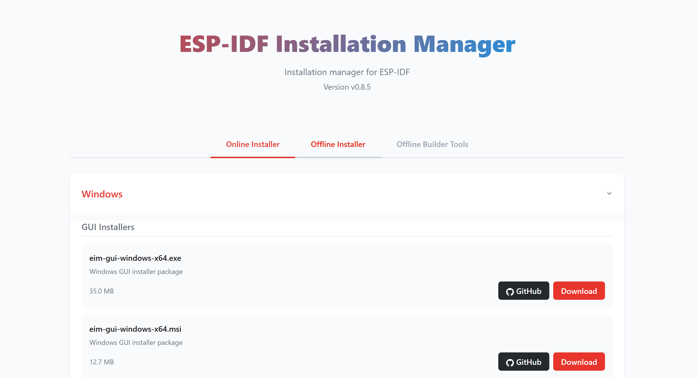

下载完成后运行安装程序，按照提示完成安装。安装完成后，可以在开始菜单中找到 `ESP-IDF Installation Manager` 并启动。

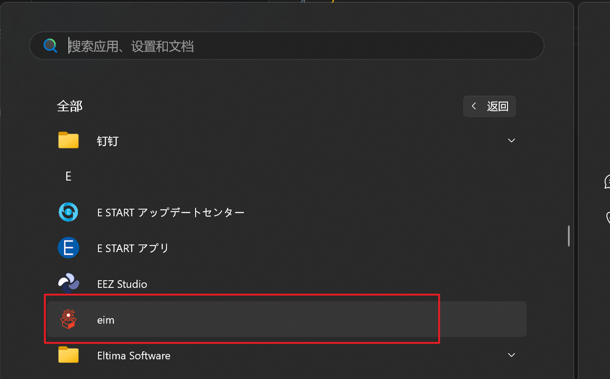
## 三、 使用 EIM 安装 ESP-IDF

### 3.1 启动 EIM

启动 EIM 后，你会看到简洁的主界面。如果这是你第一次使用，界面会提示你安装 ESP-IDF。

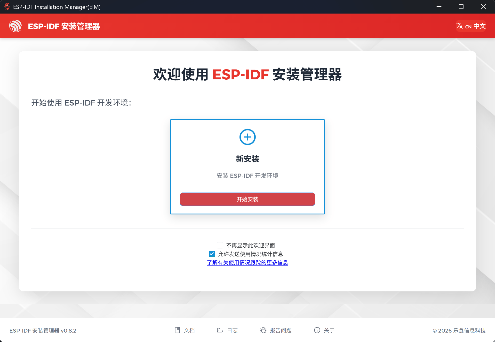


选择安装ESP-IDF开发环境，这里提供了四个功能，分别是简易安装，自定义安装，离线安装，和加载配置。前面两个都是从网络拉取安装包，实测还是很容易安装失败，所以这里建议还是使用离线安装：

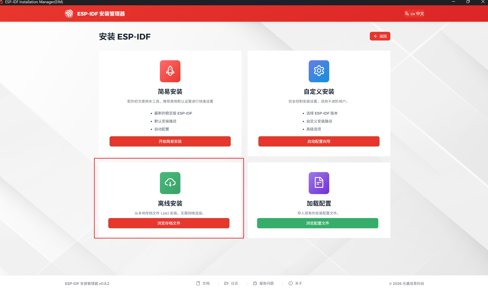


离线安装需要回到EIM的网站去手动下载存档文件，链接： https://dl.espressif.com/dl/eim/?tab=offline  ，界面如下：

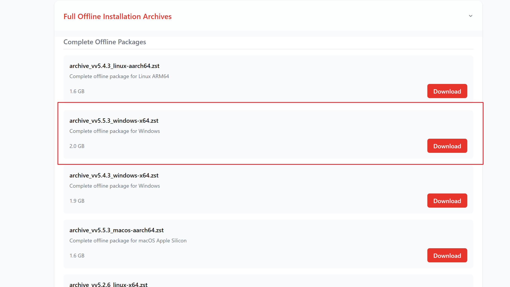

我们选择对应系统，和对应版本即可，这里我安装ESP-IDF V5.5.3  ，也是目前的最新版本。

下载好后我们选择离线安装，选择我们下载的离线存档文件：

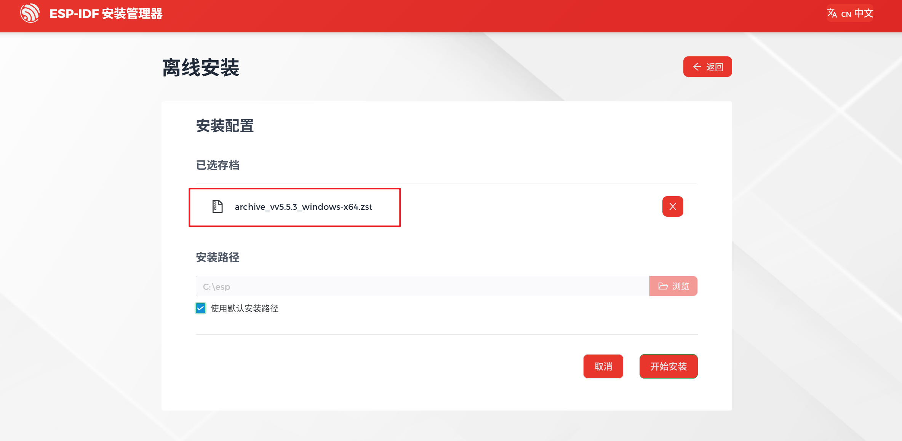

>这里可以自行选择安装位置，但是实测ESP-IDF环境需要的工具文件依然会存放到C盘中，目录为`C:\Espressif` 这些工具文件是主要占内存的文件（7-8G）。

这里我就安装到默认的C盘：

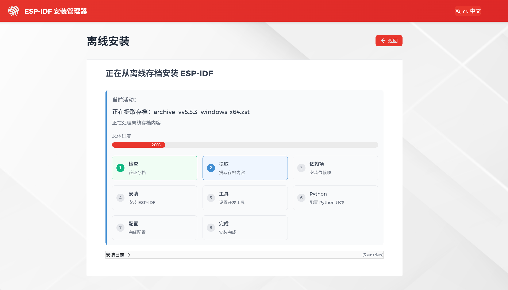

安装好后如图：

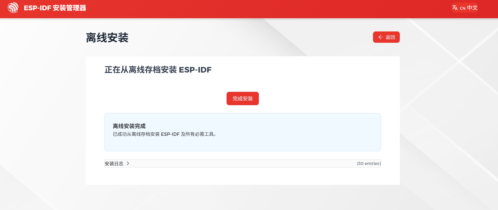

我们可以使用EIM安装多个版本的ESP-IDF:

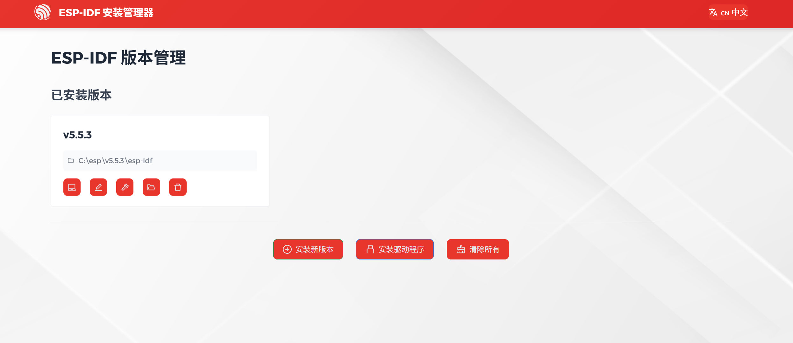

## 四、 配置 VS Code 开发环境

EIM 安装好底层环境后，我们需要配置代码编辑器。

### 4.1 安装 VS Code 及插件

1.  下载并安装 [Visual Studio Code](https://code.visualstudio.com/)。

2.  在扩展商店搜索 `Espressif IDF`，找到官方插件并安装。 **注意**：请确保插件版本为 **v2.0.0** 或更高，旧版本可能无法完美支持 EIM。

    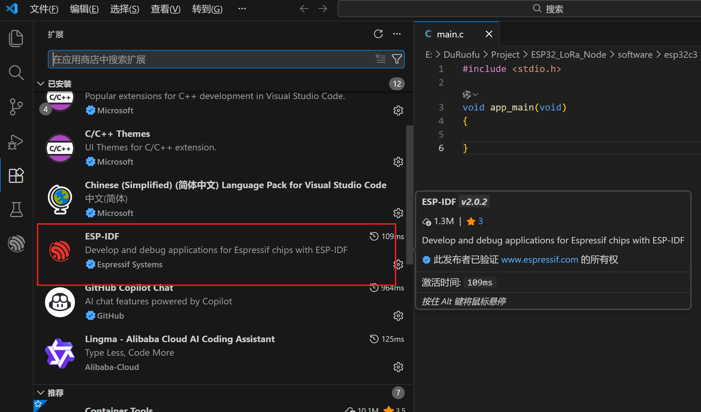

### 4.2 使用插件

得益于 EIM 的统一管理，VS Code 插件 (v2.0+) 会**自动识别**通过 EIM 安装的 ESP-IDF 环境。

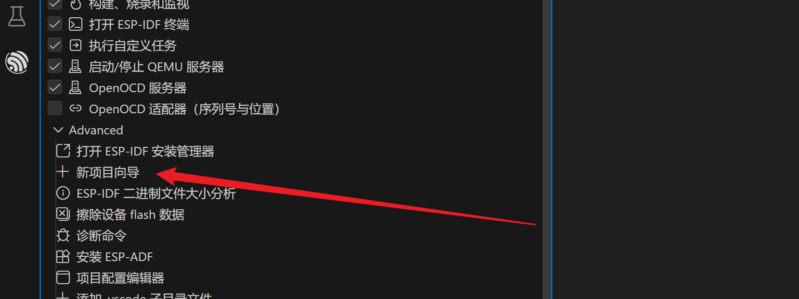

我们直接点击新建项目：

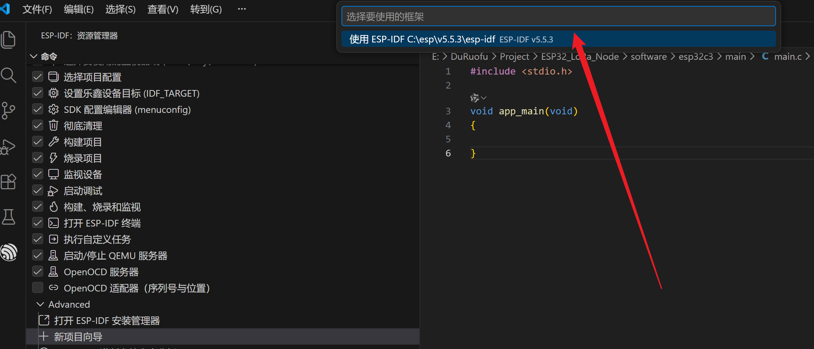

可以看到已经可以识别到我们安装的环境了，不需要以前在插件里还要进行繁琐的配置了。这是2.0版本插件最大的升级。
至此我们就配置好了ESP-IDF的开发环境。

> [!NOTE] 总结
> 使用 EIM + VS Code 插件 v2.0，我们不再需要手动去配置复杂的 Python 环境和环境变量。EIM 负责底层的 SDK 管理，VS Code 负责代码编辑和调试，两者分工明确，大大降低了入门门槛。
